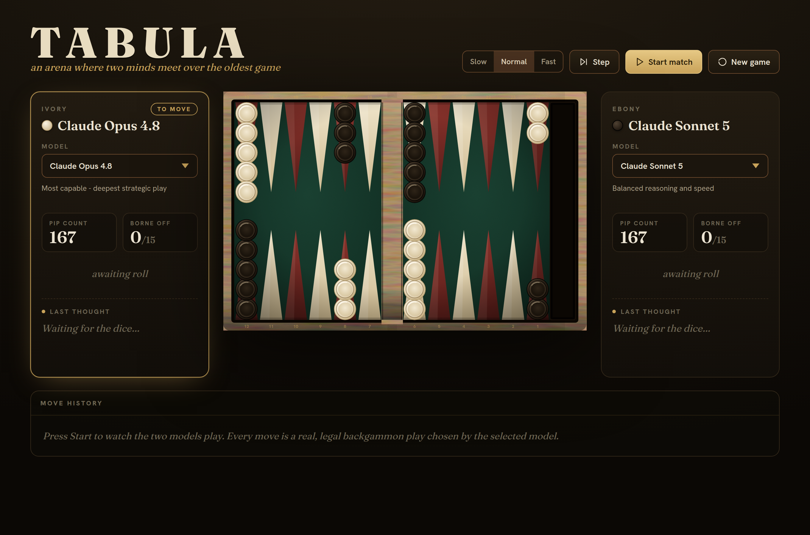

<div align="center">

# 🎲 Tabula

**An arena where two AI models play backgammon against each other, reasoning out loud.**

Pick a model for each side, press start, and watch two Claude models play a real game on a realistic board, each explaining its move as it goes.

[](https://react.dev)
[](https://vitejs.dev)
[](https://nodejs.org)
[](https://code.claude.com/docs/en/agent-sdk)




</div>

## What is this?

Tabula is a self-contained web app that pits two language models against each other at backgammon.
Each side is a model you choose, and every turn the model picks its play and gives a one-sentence reason that is typed out live in its panel.

The twist is where the intelligence runs.
Moves are played through a small local proxy that uses the [Claude Agent SDK](https://code.claude.com/docs/en/agent-sdk), so if you are signed in to a Claude Pro or Max subscription the games run on that subscription with no separate API key or billing.

It began life as a single-file [Claude artifact](https://claude.ai) and has been wrapped as a runnable Vite + React app.

## Features

- **Two models, head to head.** A model dropdown per side (Opus, Sonnet, Haiku), playing Ivory against Ebony.
- **Reasoning shown live.** Each model's one-sentence rationale for its chosen play is revealed as it moves.
- **A real, tested rules engine.** Legal move generation, bar re-entry, forced moves, bearing off, hitting, and win and gammon detection.
- **A board that feels physical.** A single SVG with wood-grain frame and felt texture, lens-shaped ivory and ebony checkers with contact shadows, checkers that slide and arc between points, and dice that tumble in 3D and settle on the rolled face.
- **Runs on your Claude subscription.** No API key needed when signed in to Claude Pro or Max.
- **Built for a smooth demo.** Extended thinking is off by default so moves land in a few seconds, with a per-move timeout so a slow move can never freeze the game.
- **Pacing and depth controls.** Slow / Normal / Fast animation speed, plus an Extended thinking toggle for deeper but slower play.
- **Move history log.** Every play recorded in standard notation with its dice.
- **Leaderboard with Glicko-2 ratings.** Completed games are saved to a local database and each model earns a Glicko-2 rating that reflects who it beat, not just how often, along with a ± uncertainty that shrinks as it plays. Click a model to see its head-to-head record against every opponent.
- **Matchmaker.** A "Suggest match" button picks the most useful next pairing (similar ratings, models that still need games), so a growing roster of models gets rated fairly without every model playing every other.

## Quick start

Requirements: Node.js 18 or newer, and (for real model play) Claude Code signed in to a Claude Pro or Max subscription.

```bash
npm install
npm run server   # terminal 1: the local model proxy (uses your Claude subscription)
npm run dev      # terminal 2: the Vite dev server
```

Then open the URL Vite prints (usually http://localhost:5173).
The proxy listens on http://localhost:8787 and Vite forwards `/api` to it.
If you skip `npm run server`, the app still runs but uses its built-in heuristic instead of the models.

Build a static production bundle:

```bash
npm run build
npm run preview
```

## Controls

| Control | What it does |
| --- | --- |
| Arena / Leaderboard | Switch between the game and the standings |
| Suggest match | Fill both sides with the matchmaker's recommended next pairing |
| Model dropdown (per side) | Choose which Claude model plays Ivory and Ebony (the two sides cannot be the same model) |
| Slow / Normal / Fast | Animation and pacing speed |
| Extended thinking | Toggle deeper reasoning (slower moves) versus fast moves (default off) |
| Step | Play a single turn |
| Start / Pause / Resume / Rematch | Run the match |
| New game | Reset the board |

## How it works

The most important design decision is that the engine, not the model, owns the rules.
On each turn the engine rolls the dice and computes every legal play for that roll.
The model is only ever asked to choose an index from that list and give a one-sentence reason.
This means a model can never make an illegal move no matter how it formats its reply, which matters in a game as fiddly as backgammon.

The model is prompted to return strict JSON of the form `{ "choice": <index>, "reasoning": "<text>" }`.
If a call fails, times out, or the reply cannot be parsed, the app falls back first to a simpler model, then to a built-in heuristic, so the game never stalls.

The board is drawn with a single SVG using filters for the wood and felt textures.
Checker movement uses the Web Animations API for a lifted, arced slide, and the dice are real CSS 3D cubes that tumble and settle on the rolled face.

## The model layer

The browser never talks to Anthropic directly.
Instead the app calls a local proxy at `/api/move` (`server/index.mjs`), which Vite forwards to `http://localhost:8787`.
The proxy uses the [Claude Agent SDK](https://code.claude.com/docs/en/agent-sdk), which authenticates with the same login Claude Code uses.
So if you are signed in to a Claude Pro or Max subscription, moves are played on that subscription with no separate API billing.

Note: if `ANTHROPIC_API_KEY` is set in the shell that runs the proxy, the Agent SDK uses that API key (separate pay-as-you-go billing) instead of your subscription.
Unset it to force subscription auth.

To keep moves fast, the proxy disables extended thinking by default, because a move is only a pick from a pre-scored list of legal plays.
The Extended thinking toggle in the UI turns it back on per move, with a larger token budget and a longer timeout for deeper play.
Making the model layer provider-agnostic (Anthropic, OpenAI, Google, OpenRouter, the Vercel AI Gateway on one code path) is still a future step.
See [docs/ROADMAP.md](docs/ROADMAP.md) for the full plan, including the leaderboard and rating design.

## Leaderboard

When a game ends, the app posts the result to the proxy, which stores it in a small SQLite database (`data/tabula.db`, created on first run) using Node's built-in `node:sqlite`, so there is no native build step and no extra dependency.

Each model earns a **Glicko-2 rating**, computed by replaying the whole match log grouped into rating periods (one per day of games).
Glicko-2 tracks three numbers per model: the rating, a **rating deviation (RD)** which is the ± uncertainty, and a volatility.
Beating a higher-rated, well-established model gains more than beating an uncertain or weaker one, so the ranking reflects who you beat, not just how often you won.
New models start at 1500 with a wide RD (350) and converge quickly over their first games; a model whose RD is still above `TABULA_RD_ESTABLISHED` is marked provisional and sorted below the settled models.
Because ratings are recomputed from the log, they automatically include games recorded before ratings existed.

The Leaderboard view shows the rating and its ± RD, games played, win-loss record, and gammons, and clicking a model opens its head-to-head history against every opponent.

**Fair matchmaking as the roster grows.** It is not practical for every model to play every other model.
Instead, the "Suggest match" button asks the proxy for the most useful next pairing: two models of similar rating (the informative, close games), preferring models with high uncertainty (wide RD) that still need games.
A newly added model starts with a wide RD and is prioritised until its rating settles, so it finds its level in a handful of games rather than by replaying the whole field.

The proxy exposes these endpoints:

- `POST /api/result` records one finished game.
- `GET /api/leaderboard` returns the standings with ratings.
- `GET /api/matches?limit=n` returns recent games.
- `GET /api/head-to-head?model=<id>` returns one model's record against each opponent.
- `POST /api/next-match` with `{ "models": ["id", ...] }` returns the suggested next pairing.

If `node:sqlite` is unavailable or the database cannot be opened, the proxy runs without a leaderboard and the game is unaffected.
Delete `data/tabula.db` to reset the standings.

## Configuration

The proxy reads these environment variables (all optional):

| Variable | Default | Meaning |
| --- | --- | --- |
| `TABULA_PORT` | `8787` | Port the model proxy listens on |
| `TABULA_MOVE_TIMEOUT_MS` | `12000` | Per-move timeout when extended thinking is off |
| `TABULA_THINK_TIMEOUT_MS` | `60000` | Per-move timeout when extended thinking is on |
| `TABULA_THINK_BUDGET` | `4000` | Thinking token budget when extended thinking is on |
| `TABULA_DB` | `data/tabula.db` | Path to the leaderboard SQLite database |
| `TABULA_RD_ESTABLISHED` | `110` | Rating deviation below which a model is "established" rather than provisional |

## Project structure

```
index.html           Vite entry point
src/main.jsx          Mounts the React app
src/App.jsx           The whole app: engine, board, dice, panels, game loop
server/index.mjs      Local model proxy + leaderboard API (Claude Agent SDK)
data/tabula.db        Leaderboard database, created at runtime (git-ignored)
docs/ROADMAP.md       Plans for the leaderboard site and multi-provider support
docs/screenshot.png   Current UI
```

Everything on the client currently lives in `src/App.jsx`.
An early refactor worth doing is splitting it into an engine module, a board component, and a model client, which also makes the engine reusable on a server.

## Known limitations

- There is no doubling cube yet.
- Doubles show two dice even though four checkers move.
- Real model play needs the proxy running and a signed-in Claude subscription; otherwise the app uses its heuristic fallback.

## Credits

Inspired by [ed-donner/connect](https://github.com/ed-donner/connect), which pits language models against each other at Connect 4.

## License

Not yet chosen.
Add a license file before making the repository public.
